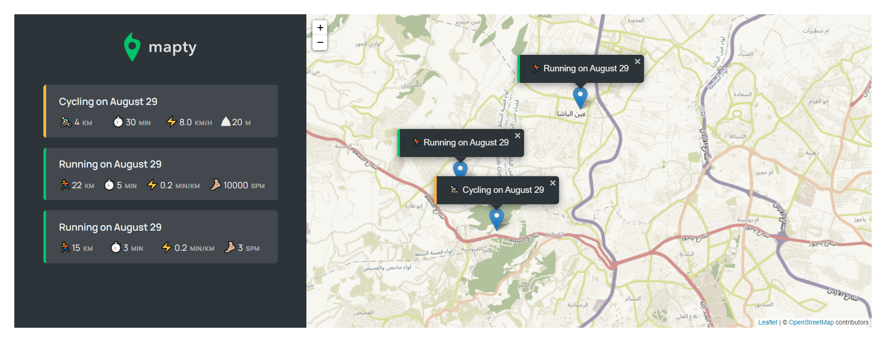

# Mapty

## Table of contents

- [Overview](#overview)
  - [Screenshot](#screenshot)
  - [Links](#links)
- [My process](#my-process)
  - [Built with](#built-with)
  - [What I learned](#what-i-learned)
  - [Continued development](#continued-development)
- [Author](#author)

## Overview

Mapty is website that tracks your workouts and shows them on the map and on a list to the side so you can view them at your leisure.
it makes use of the Leaflet library and the Geolocation API to get your coordinates, if you allow it ,and show it on the map that renders with the help of Leaflet, from there you can click anywhere on the map to add a new workout with different details.

- Easy on the eyes design and an easy to use intuitive interface.

- Map integration.

- Click anywhere on the map to open a form that'll allow you to add a new workout to both the list and the map.

- Easy to understand error handling to help you identify and rectify the mistake the user made when inputting the details of the workout.

- Utilized local storage to save state so that the user can quit and comeback and still have all of the workouts he added before.

This project is largely based on the "The Complete JavaScript Course 2023: From Zero to Expert!" by Jonas Schmedtmann on Udemy.

### Screenshot

### Links

- Live Site URL: (https://safensound95.github.io/mapty/)

## My process

### Built with

- HTML5
- CSS
- Flexbox
- CSS Grid
- Javascript
- ES6
- Object oriented programming

### What I learned

Used lots of OOP in this project, also the integration of the library(leaflet), and usage of local storage.
it was certainly a fun challenge, and we ended up with a useful application that's ready to be used.

### Continued development

I have many features in mind for this one that I plan to implement in the near future to make it much more feature rich that it is at the time being.

## Author

- Frontend Mentor - [@SafeNSound95](https://www.frontendmentor.io/profile/SafeNSound95)
- Codewars - [@SafeNSound95](https://www.codewars.com/users/SafeNSound95)
- Exercism - [@SafeNSound95](https://exercism.org/profiles/SafeNSound95)
